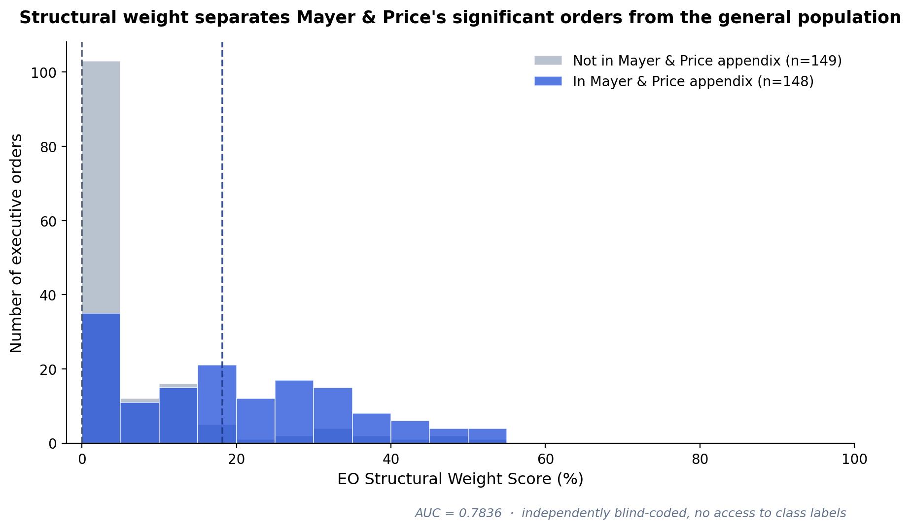
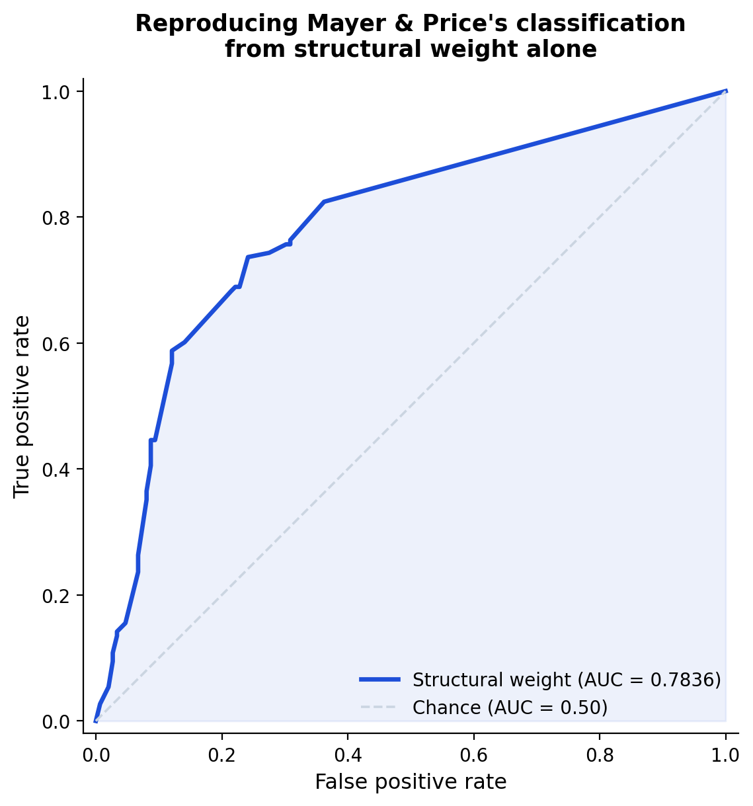

# EO Structural Weight vs. Mayer & Price (2002): What Matches, What Diverges, and Why

*How a rule-based structural audit compares to the field's standard measure of executive order significance.*

---

## The short version

Mayer & Price (2002) classify 149 executive orders (1949–99) as "significant" through expert judgment, and treat everything else as not significant. The EO Structural Weight Score classifies nothing — it applies eleven fixed governance-architecture rules to an order's text and produces a continuous score, with no reference to whether the order is politically important.

Applied blind to the full 298-order validation sample (their 149 plus a matched random draw of 149 more), structural weight recovers their classification with **AUC = 0.7836** — a coder with no access to Mayer & Price's labels, scoring text alone, reconstructs 78% of the discriminating information in their expert classification.

That's the headline. The more useful finding is in the 22% it doesn't reconstruct — a substantial, well-documented set of cases where the two measures point in different directions, and the reasons are legible rather than random.

---

## Where they agree

The separation between classes is visible before any statistic is computed. Orders in Mayer & Price's appendix score a mean of 19.2% (median 18.2%); orders outside it score a mean of 6.0% (median **0.0%** — most of the general population of executive orders has essentially no governance-architecture machinery in it at all, by this measure).

This is the expected relationship, and it's reassuring that it holds: significant policy action, on average, deploys more governance machinery — broader delegated authority, less oversight, more discretion — than routine administrative action does. An instrument that measures architecture should correlate with a measure of importance, because important actions usually *do* something architecturally consequential. The 0.78 AUC says that relationship is real and substantial.

## Where they diverge, and why it isn't noise

A correlation of 0.78 leaves real daylight, and the cases inside that daylight sort into two clean categories.

### Significant, but architecturally clean

Several of Mayer & Price's most consequential orders score at or near zero on structural weight — not because the coding missed something, but because these orders achieve major policy change through *well-bounded* mechanisms: multi-party balance, sunset clauses, preserved judicial review, narrow delegated scope.

| EO | Year | Score | What Mayer & Price flagged it for | Why it scores low |
|---|---|---|---|---|
| 11375 | 1967 | 5.0% | Extends federal equal-employment coverage to sex discrimination | Uses the exact same enforcement architecture already validated for race discrimination — no new discretionary authority, no accountability gap |
| 12139 | 1979 | 0.0% | Implements FISA, the foundational surveillance-oversight statute | Preserves the FISA Court, requires Senate-confirmed certifying officials — a landmark reform that is *also* a landmark in restraint |
| 12958 | 1995 | 4.5% | Overhauls the classified-information system | Automatic 25-year declassification default, explicit anti-abuse prohibitions, an independent appeals panel |
| 11785 | 1974 | 0.0% | Dismantles the Attorney General's list of subversive organizations | A power-narrowing reform reads as clean by construction — removing discretion doesn't create a new accountability gap |
| 13010 | 1996 | 6.25% | Foundational order behind decades of subsequent U.S. cybersecurity policy | Establishes a coordinating framework, not a new grant of unilateral authority |

These are not cases where the instrument disagrees with Mayer & Price about what happened. They're cases where "this mattered enormously" and "this was built with restraint" are simultaneously true, and Mayer & Price's binary classification has no way to register the second fact. Structural weight can hold both at once — which is arguably its main advantage as a complementary measure rather than a replacement.

### Architecturally heavy, but outside their sample

The reverse case: orders carrying substantial structural weight that Mayer & Price's methodology didn't select. Some of this is a direct artifact of their sampling window (1949–99 only); some of it reflects orders whose architecture is heavy but whose profile was never politically prominent enough to register on an expert-judgment measure.

| EO | Year | Score | What it does | Why the weight |
|---|---|---|---|---|
| 9250 | 1942 | 45.5% | FDR's "Hold the Line" wartime economic stabilization order | Sweeping, explicitly "final" authority over the entire wartime economy — the highest score in the negative-class sample, and not inherited from any other order. An independently complex, historically major action that simply falls outside Mayer & Price's window. |
| 9001 | 1941 | 31.8% | Foundational WWII war-production contracting authority, issued 20 days after Pearl Harbor | Broad, largely unreviewed contracting discretion at the start of the wartime economy |
| 8565 | 1940 | 27.8% | One-paragraph extension of an existing property-control framework to Romania | Inherits the full weight of the framework it extends by incorporation — brief text, heavy architecture |
| 12318 | 1981 | 8.3% | Establishes OIRA's statistical-policy role inside OMB | Low score, but foundational to what became one of the most consequential institutions in the modern regulatory process — a case where even a *modest* score sits on top of major institutional significance, illustrating that the two measures answer genuinely different questions |

EO 9250 is the cleanest example: nothing about it is an artifact of another order's weight, nothing about its finding depends on ambiguous judgment calls — it's simply a major, architecturally sweeping order that predates and falls outside the specific 1949–99 census Mayer & Price built.

### Both at once

The confirming case: EO 11615, Nixon's 1971 wage-price freeze, is in Mayer & Price's appendix *and* scores 31.8% — historically major and structurally heavy simultaneously. This is what the two measures look like when they're both correctly tracking the same underlying reality, and it's the majority pattern in the data (the whole reason the AUC is 0.78, not 0.50).

---

## What this suggests about the two measures

Mayer & Price answer a question structural weight doesn't ask: was this order politically consequential, in the judgment of people who study the presidency. That's a real, valuable measure, and nothing here displaces it.

Structural weight answers a question their measure doesn't ask: regardless of political consequence, how much unreviewed discretion, unaccountable authority, or structurally risky machinery does this specific text deploy. The comparison above is the case for why that's worth measuring separately — because "important" and "architecturally risky" are correlated but not identical, and several of the most instructive cases in American executive-order history are instructive precisely because they come apart. A structural audit is reproducible in a way expert classification structurally cannot be: two people applying the same eleven written rules to the same text should converge, which is a testable claim and, per the blind validation this comparison is built on, one that holds up.

---

## Data and reproduction

All figures in this document are computed from `../validation/blind-coding-results.json` (the independent blind coding run) against `../validation/validation-key.csv` (true Mayer & Price classification). Full computation, audit trail, and the two prior validation iterations that preceded this result are documented in `../validation/auc-results.md`. The complete divergence catalog — every case where the two measures disagree by more than a marginal amount, not just the ones highlighted here — is in `../findings/notable-findings.md`.
