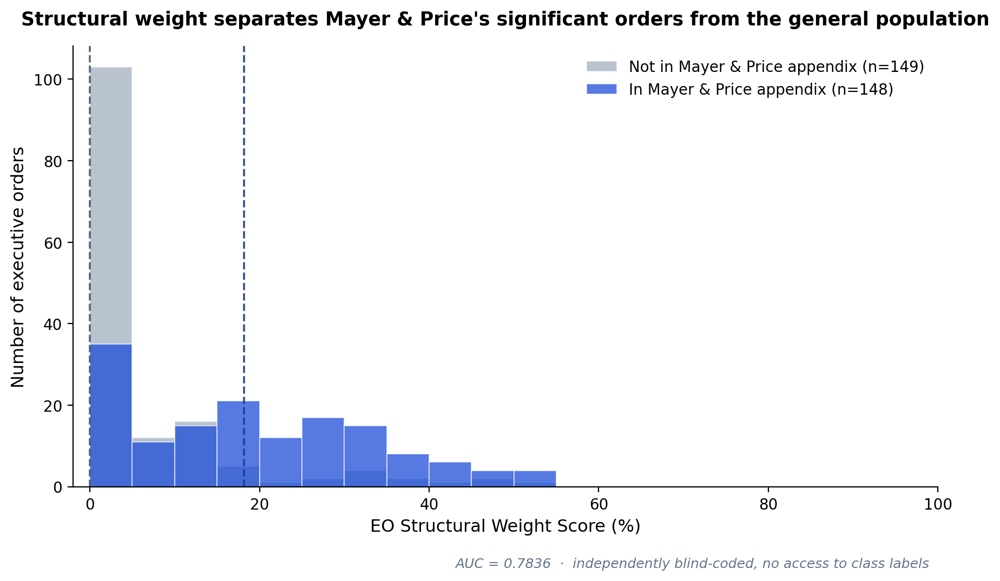
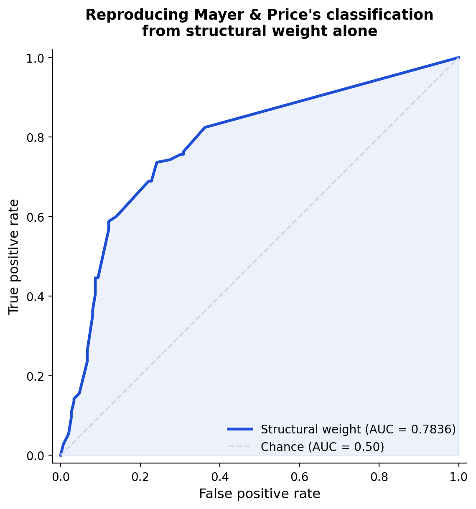

# EO Structural Weight vs. Mayer & Price (2002): What Matches, What Diverges, and Why

*How a rule-based structural audit compares to the field's standard measure of executive order significance.*

> **Correction (2026-09-18).** An earlier version of this document said its figures came from the blind coding run. Its divergence tables actually used the original coding, which knew which orders Mayer & Price had flagged. Several lead examples don't hold in the blind run. The worst are EO 12139 (FISA; 0% claimed, 18.2% blind), EO 11785 (0% claimed, 18.2% in blind v2) and EO 12958 (4.5% claimed, 27–32% blind). Every table below now shows all three codings, and an order is used as an example only if it meets the claim in every coding. The full audit is in `../robustness/AUDIT.md`.

---

## The short version

Mayer & Price (2002) classify 149 executive orders (1936–99) as "significant" by expert judgment. The EO Structural Weight Score doesn't classify anything. It applies eleven fixed governance-architecture rules to an order's text and produces a continuous score.

Applied by a label-blind AI coder to 297 orders (their 149 plus a random draw of 149 others, with EO 9981 excluded), structural weight separates the two groups with **AUC = 0.784 (95% bootstrap CI 0.731–0.835)**. In plain terms: pick one significant order and one other order at random, and the significant one scores higher 78% of the time.

Three qualifications belong next to that number:

- **Length does nearly as well.** Word count alone gives AUC = 0.781. The score adds information beyond length and year (likelihood-ratio χ² = 31.6), and its AUC within length terciles is 0.72. So the score isn't only a length proxy, but a large part of its separating power is shared with length.
- **The blind coder saw each order's number, title, date and president.** It may have recognized famous orders. A masked re-coding test is designed to check this (`../robustness/masked-recode/`).
- **The coders are AI models.** Both blind runs used the same model family. Agreement between them is flag-level κ = 0.66, and κ = 0.43 against the original coding. No human coding exists yet.

---

## Where they agree

In the blind run, orders in Mayer & Price's appendix score a mean of 19.2% (median 18.2%). Orders outside it score a mean of 6.0% (median 0.0%).

That is the expected relationship. Significant policy action usually deploys more governance machinery than routine administrative action does.

## Where they diverge

About one pair in five is ranked "the wrong way" (1 − AUC = 0.22). Much of that is coding noise, not a meaningful difference between the measures:

- 52 of the 296 orders coded three times differ by 20 points or more across the codings.
- Claims about *individual* orders are therefore only made below when they hold in all three.

### Significant, but architecturally clean (≤10% in every coding)

38 of the 148 significant orders meet this bar. Examples:

| EO | Year | Original | Blind v1 | Blind v2 | What it does |
|---|---|---|---|---|---|
| 9808 | 1946 | 0.0 | 0.0 | 0.0 | Truman's President's Committee on Civil Rights. Independent membership; dissolves on delivering its report. |
| 12202 | 1980 | 0.0 | 0.0 | 0.0 | Nuclear Safety Oversight Committee (post–Three Mile Island) |
| 12183 | 1979 | 0.0 | 0.0 | 0.0 | Revokes Rhodesian sanctions |
| 12961 | 1995 | 0.0 | 0.0 | 0.0 | Presidential Advisory Committee on Gulf War Veterans' Illnesses |
| 11375 | 1967 | 5.0 | 4.5 | 4.5 | Adds sex discrimination to federal equal-employment coverage, using the enforcement structure already in place for race |

Many are time-limited advisory bodies or orders that *remove* authority. Both kinds are consistent with an instrument that measures architecture rather than importance.

**Withdrawn as examples** because they fail in at least one blind run:

| EO | Year | Original | Blind v1 | Blind v2 | Subject |
|---|---|---|---|---|---|
| 12139 | 1979 | 0.0 | 18.2 | 18.2 | FISA implementation |
| 11785 | 1974 | 0.0 | 0.0 | 18.2 | Ends the Attorney General's list |
| 12958 | 1995 | 4.5 | 27.3 | 31.8 | Classified-information overhaul |
| 13010 | 1996 | 6.25 | 21.4 | 4.5 | Critical infrastructure protection |

**Why the original coding over-produced these examples.** Knowing the labels pushed the original coder's scores for significant orders down by an average of 8.3 points relative to blind v2, while non-significant orders moved only 1.5 points. In the original coding, 64% of significant orders score ≤10. In all three codings, only 26% do. See `../robustness/AUDIT.md` §2.

### Architecturally heavy, but not in the appendix (≥25% in every coding)

Six of the 148 non-significant orders coded in all three runs meet this bar:

| EO | Year | Original | Blind v1 | Blind v2 | What it does |
|---|---|---|---|---|---|
| 9250 | 1942 | 45.5 | 40.9 | 45.5 | FDR's "Hold the Line" wartime economic stabilization order |
| 9246 | 1942 | 35.0 | 44.4 | 50.0 | Coordination and control of the rubber program |
| 11940 | 1976 | 54.5 | 40.9 | 31.8 | Continues export controls after their statute lapsed (Zombie Emergency Trap in every coding) |
| 9001 | 1941 | 31.8 | 36.4 | 45.5 | War-production contracting authority, 20 days after Pearl Harbor |
| 8565 | 1940 | 27.8 | 38.9 | 31.8 | One-paragraph extension of a property-control framework to Romania; inherits the framework's weight by incorporation |
| 11190 | 1964 | 35.7 | 25.0 | 27.3 | Screening of the Ready Reserve |

The negative class is a random draw, not Mayer & Price's actual rejected orders, since their full dataset is lost. So "not in the appendix" means "not in the published positives", not "judged insignificant by Mayer & Price". Some of these orders (EO 9250 especially) might well have been classed significant had they been in the original sample.

### Both at once (≥30% in every coding)

Nine significant orders are heavy in every coding, including:

- EO 9102 (War Relocation Authority, 1942): 50.0 / 54.5 / 45.5
- EO 11615 (Nixon's wage-price freeze, 1971): 31.8 / 40.9 / 50.0
- EO 11796 (export controls, 1974): 54.5 / 40.9 / 31.8
- EO 9570 (seizure of transportation systems, 1945)
- EO 12735 (chemical and biological weapons proliferation, 1990)

---

## What this suggests about the two measures

Mayer & Price answer a question structural weight doesn't ask: was this order politically consequential, in the judgment of scholars of the presidency.

Structural weight answers a different question: how much unreviewed discretion or unaccountable authority does this text deploy. The two are correlated, but not identical.

The comparison supports that claim at the level of the *distribution*. At the level of *individual orders*, the evidence is thinner than earlier versions of this document suggested:

- single-order scores move by 20+ points between codings for about one order in six;
- the most quotable "significant but clean" cases came disproportionately from the label-aware coding.

The instrument is designed to be reproducible: two coders applying the same written rules to the same text should converge. That is a testable claim. So far it has been tested only between AI runs, at moderate agreement (flag-level κ 0.43–0.66). Human coding and a masked re-coding test are in progress (`../robustness/masked-recode/`).

---

## Data and reproduction

Blind figures come from `blind-coding-results.json` (the blind-v2 run). Blind-v1 figures come from `archive/blind-coding-results-v1-20260705.json`. Original-coding figures come from `../database/eo_coding.db` (coder `claude-church-bells-v1`). Classes come from `validation-key.csv`. Every number in this document is reproduced by `../robustness/audit.py`; see `../robustness/audit-output.json` → `divergence` for the complete lists.
